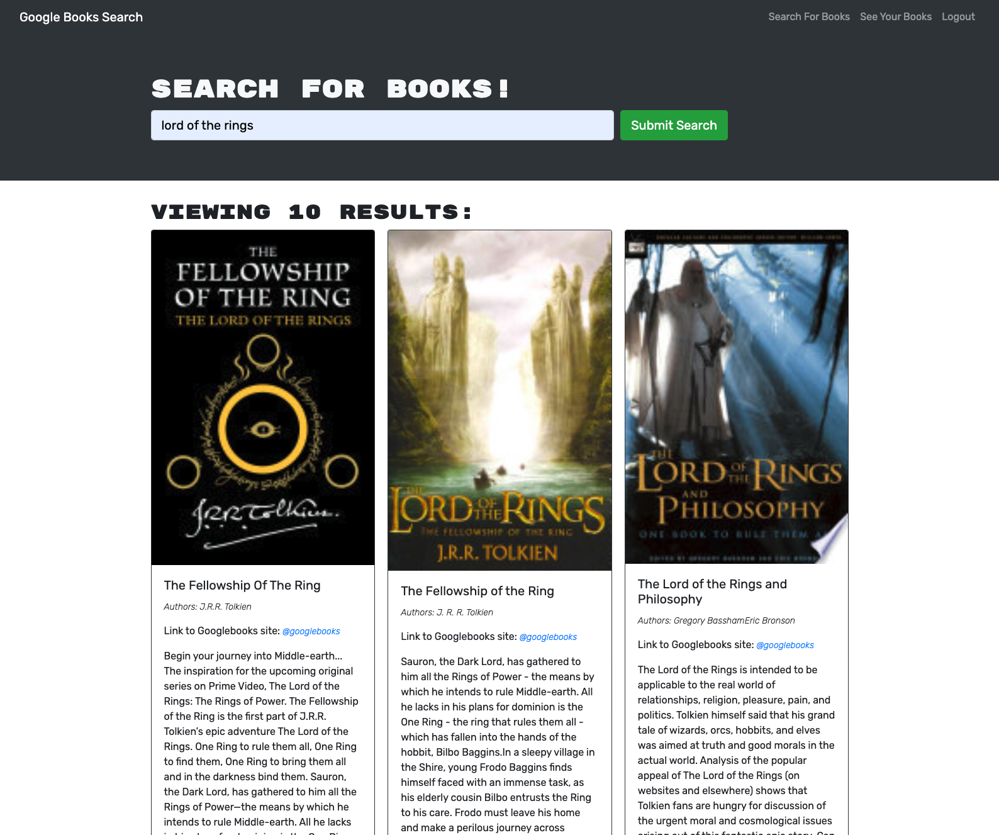
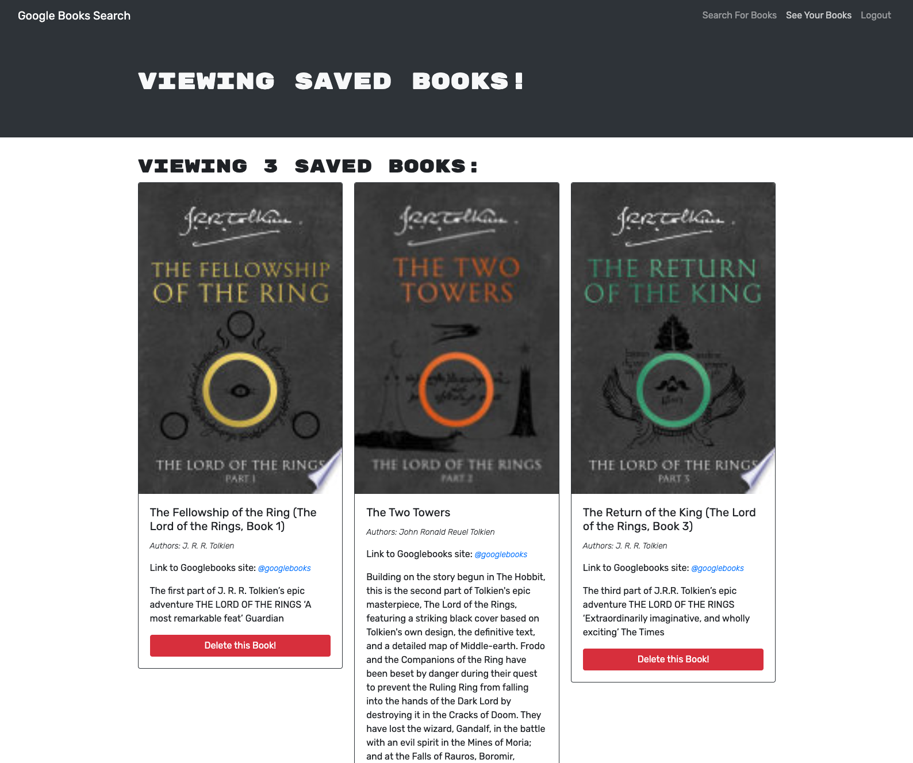

## MERN book search


*An online search tool for up to ten books, allowing the user to save their favourites to their account*

[](https://developer.mozilla.org/en-US/docs/Web/JavaScript)  [](https://developer.mozilla.org/en-US/docs/Web/CSS) [](https://developer.mozilla.org/en-US/docs/Web/HTML)

---

## Packages used
[](https://react.dev/) [](https://nodejs.org/en/) [](https://mongoosejs.com/) [](https://expressjs.com/) [](https://graphql.org)

---

## Links
GitHub Repository: [@elibrer](https://github.com/Elibrer/mern-book-search)

Link to deployed application: [@Zweck Book Search](https://zweck-book-search-c53d8ce1c48e.herokuapp.com/)

---

## Contributors
> Elijah Brereton @[GitHub](https://github.com/elibrer)

---

## Table of Contents
- [Description](#description)
- [Installation](#installation)
- [Features](#features)
- [Documentation](#documentation)
- [Application Preview](#application-preview)
- [License](#license)
- [Tests](#tests)
- [Questions](#questions)

---

## Description
A simple application that searches the Googlebooks api using input from the user for up to ten displayed books. It allows the user to view an image, title and description of those books, alongside a link to the googlebooks website allowing the user to purchase the book if willing. Further, the user may sign up and log in with encrypted password details allowing them to save books to their account for future viewing. This could be a good way to store a list of 'wishlist' books, in which the user may want to read eventually. 

---

## Installation

For usage of this application, visit the [Book Search](https://zweck-book-search-c53d8ce1c48e.herokuapp.com/) website via heroku. No further installation is required to access and operate the web page. 


---

## Features
```md
GIVEN a book search engine
WHEN I load the search engine
THEN I am presented with a menu with the options Search for Books and Login/Signup and an input field to search for books and a submit button
WHEN I click on the Search for Books menu option
THEN I am presented with an input field to search for books and a submit button
WHEN I am not logged in and enter a search term in the input field and click the submit button
THEN I am presented with several search results, each featuring a book’s title, author, description, image, and a link to that book on the Google Books site
WHEN I click on the Login/Signup menu option
THEN a modal appears on the screen with a toggle between the option to log in or sign up
WHEN the toggle is set to Signup
THEN I am presented with three inputs for a username, an email address, and a password, and a signup button
WHEN the toggle is set to Login
THEN I am presented with two inputs for an email address and a password and login button
WHEN I enter a valid email address and create a password and click on the signup button
THEN my user account is created and I am logged in to the site
WHEN I enter my account’s email address and password and click on the login button
THEN I the modal closes and I am logged in to the site
WHEN I am logged in to the site
THEN the menu options change to Search for Books, an option to see my saved books, and Logout
WHEN I am logged in and enter a search term in the input field and click the submit button
THEN I am presented with several search results, each featuring a book’s title, author, description, image, and a link to that book on the Google Books site and a button to save a book to my account
WHEN I click on the Save button on a book
THEN that book’s information is saved to my account
WHEN I click on the option to see my saved books
THEN I am presented with all of the books I have saved to my account, each featuring the book’s title, author, description, image, and a link to that book on the Google Books site and a button to remove a book from my account
WHEN I click on the Remove button on a book
THEN that book is deleted from my saved books list
WHEN I click on the Logout button
THEN I am logged out of the site and presented with a menu with the options Search for Books and Login/Signup and an input field to search for books and a submit button  
```

---

## Documentation
No documentation provided.

---

## Application Preview
### `Home page`

### `Logged in search`

### `Logged in saved books`


---

## License
[Licensed under the MIT license.](https://opensource.org/licenses/MIT)

---

## Tests
To test, simply run the application by using the instructions provided above. If there are any errors, or the application did not work in the intended way, please try to locate and log the lines of code that bring up the error, and forward all issues to the email below.

---

## Questions
For questions and enquiries, please contact me at: 
[eli.brer@gmail.com](eli.brer@gmail.com)